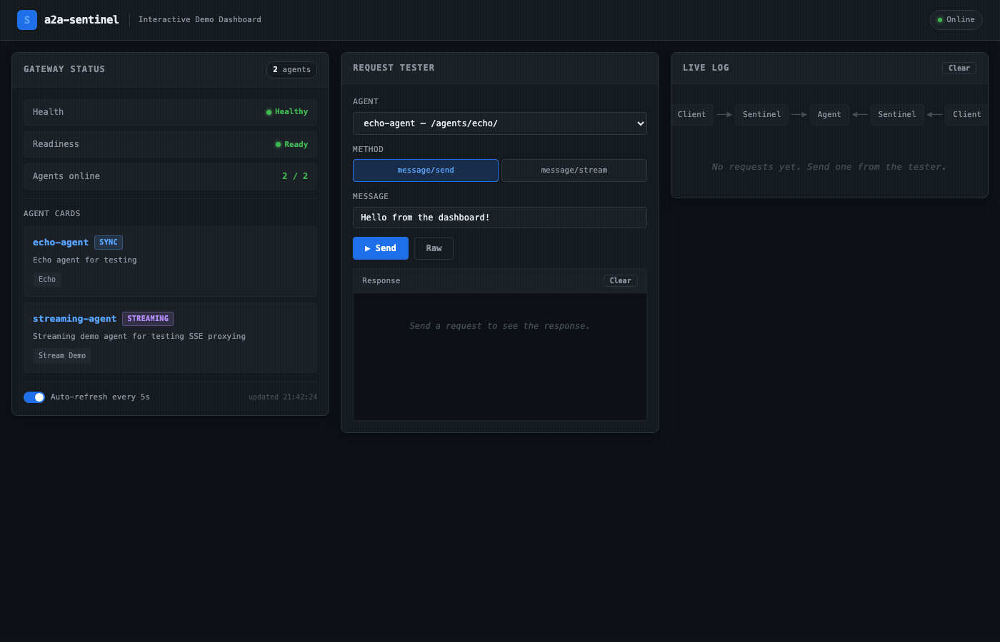

# a2a-sentinel

[English](../../README.md) | **한국어**

[](https://go.dev)
[](LICENSE)
[](https://github.com/raeseoklee/a2a-sentinel/actions/workflows/ci.yml)

**Go로 작성된 경량 보안 우선 A2A 게이트웨이.**

sentinel로 개발하고, agentgateway로 배포하세요. 에이전트 코드 변경 없이.


---

## 왜 sentinel인가?

a2a-sentinel은 [agentgateway](https://github.com/agentgateway/agentgateway)(Kubernetes 네이티브 A2A+MCP 데이터 플레인)를 대체하려는 것이 아닙니다. 대신 다른 필요를 채웁니다: Kubernetes 설정을 기다리지 않고 5분 안에 에이전트에 A2A 보안을 추가하려는 개발자를 위한 것입니다.

| | agentgateway | a2a-sentinel |
|---|---|---|
| **대상** | 플랫폼/인프라 팀 | 개인 개발자, 소규모 팀 |
| **배포** | Kubernetes 네이티브 | 단일 바이너리, docker compose |
| **범위** | 전체 데이터 플레인 (A2A+MCP+LLM) | A2A 보안 게이트웨이 |
| **설정** | 광범위한 YAML/API/CRD | Agent Card = 설정 |
| **보안** | 설정 가능 | 기본적으로 ON |
| **첫 요청까지** | ~30분 (K8s 설정) | ~5분 (docker compose up) |
| **에러 메시지** | 표준 코드 | 교육적 (hint + docs_url) |
| **바인딩** | gRPC + REST + JSON-RPC | JSON-RPC + REST + gRPC (v0.3) |
| **관리** | K8s 도구 | MCP 서버 (15개 도구, v0.3) |
| **마이그레이션** | — | 무중단 (동일한 A2A 프로토콜) |

---

## 기능

- [x] 2계층 속도 제한 (IP 기반 사전 인증 + 사용자 기반 사후 인증)
- [x] Agent Card 변경 감지 (캐시 오염 방어)
- [x] 인증 모드 (JWT, API Key, passthrough-strict 기본값)
- [x] HTTP + SSE 프록시 (httputil.ReverseProxy 미사용)
- [x] 구조화된 감사 로깅 (OTel 호환, 설정 가능한 샘플링)
- [x] 교육적 에러 메시지 (모든 차단에 hint + docs_url 포함)
- [x] 집계된 Agent Card (모든 백엔드의 스킬을 병합)
- [x] SSE 스트림 드레이닝을 포함한 그레이스풀 셧다운
- [x] 헬스 체크 (/healthz, /readyz, 설정 가능한 준비 상태 모드)
- [x] Agent Card JWS 서명 검증
- [x] 푸시 알림 SSRF 방어
- [x] 재전송 공격 방지 (nonce + 타임스탬프)
- [x] 완전한 MCP 서버 (15개 도구, 4개 리소스, MCP 2025-11-25 Streamable HTTP)
- [x] sentinel migrate 명령어 (agentgateway로 마이그레이션)
- [x] Card 변경 승인 모드 (MCP 기반)
- [x] Prometheus 호환 메트릭 엔드포인트 (/metrics)
- [x] JSON-RPC 프로토콜 변환을 포함한 gRPC 바인딩 지원
- [x] Config 핫 리로드 (SIGHUP + 파일 감시 + 디바운스)
- [x] 히스토그램을 포함한 확장 Prometheus 메트릭 (prometheus/client_golang)
- [x] Kubernetes 배포용 Helm 차트
- [x] ABAC 정책 엔진 (IP, 사용자, 에이전트, 메서드, 시간 기반, 헤더 규칙)
- [x] 다국어 지원 (i18n) — Accept-Language 기반, 한국어 + 영어

---

## 빠른 시작 (5분)

### 사전 준비

- Docker 및 Docker Compose (또는 Go 1.22+)

### 클론 및 실행

```bash
git clone https://github.com/raeseoklee/a2a-sentinel
cd a2a-sentinel
docker compose up -d --build
```

서비스가 정상 상태가 될 때까지 기다리세요 (`docker compose logs -f`로 로그 확인).

**http://localhost:3000** 에서 인터랙티브 데모 대시보드를 여세요.



설정에는 두 개의 데모 에이전트가 포함됩니다:
- **echo-agent**: 표준 동기 A2A 에이전트
- **streaming-agent**: SSE 스트리밍 에이전트

### 헬스 확인

```bash
# 게이트웨이 헬스
curl http://localhost:8080/healthz
# {"status":"ok","version":"dev"}

# 준비 상태 (모든 에이전트 정상)
curl http://localhost:8080/readyz
# {"status":"ready","healthy_agents":2,"total_agents":2}

# 집계된 Agent Card (모든 백엔드에서 병합)
curl http://localhost:8080/.well-known/agent.json | jq .
```

### 첫 번째 A2A 메시지 보내기

**JSON-RPC 바인딩 (echo 에이전트):**

```bash
curl -X POST http://localhost:8080/agents/echo/ \
  -H "Content-Type: application/json" \
  -d '{
    "jsonrpc": "2.0",
    "id": "1",
    "method": "message/send",
    "params": {
      "message": {
        "role": "user",
        "parts": [{"text": "Hello from sentinel!"}],
        "messageId": "msg-1"
      }
    }
  }'
```

**Server-Sent Events (스트리밍 에이전트):**

```bash
curl -N -X POST http://localhost:8080/agents/streaming/ \
  -H "Content-Type: application/json" \
  -d '{
    "jsonrpc": "2.0",
    "id": "2",
    "method": "message/stream",
    "params": {
      "message": {
        "role": "user",
        "parts": [{"text": "Stream test"}],
        "messageId": "msg-2"
      }
    }
  }'
```

각 청크는 별도의 SSE 이벤트로 도착합니다. 게이트웨이는 그레이스풀 셧다운 시 모든 진행 중인 스트림을 드레이닝합니다.

**gRPC 바인딩 (grpcurl 필요):**

```bash
grpcurl -plaintext -d '{
  "message": {
    "role": "user",
    "parts": [{"text": "Hello via gRPC!"}],
    "messageId": "msg-3"
  }
}' localhost:8443 a2a.v1.A2AService/SendMessage
```

gRPC 바인딩은 A2A 프로토콜 메시지를 내부적으로 JSON-RPC로 변환합니다. 에이전트는 gRPC를 지원할 필요가 없으며 sentinel이 변환을 처리합니다.

---

## 아키텍처

```
┌───────────────────────────────────────────────────────────┐
│                   a2a-sentinel Gateway                    │
│                                                           │
│  ┌──────────┐  ┌──────────┐  ┌──────────┐  ┌──────────┐   │
│  │ Security │→ │ Policy   │→ │ Protocol │→ │  Router  │   │
│  │ Layer    │  │ Engine   │  │ Detector │  │          │   │
│  │ (2-tier) │  │ (ABAC)   │  │          │  │          │   │
│  └──────────┘  └──────────┘  └──────────┘  └──────────┘   │
│       │                                        │          │
│  ┌─────────┐  ┌──────────────┐        ┌──────────────┐    │
│  │  Audit  │  │ Agent Card   │        │    Proxy     │    │
│  │  Logger │  │ Manager      │        │ HTTP/SSE/gRPC│    │
│  │ (OTel)  │  │ (polling+agg)│        │              │    │
│  └─────────┘  └──────────────┘        └──────────────┘    │
│                                              │            │
│  ┌────────────────────┐  ┌───────────────────────────┐    │
│  │ gRPC Server (:8443)│  │ Config Hot-Reload         │    │
│  │ A2A gRPC binding   │  │ SIGHUP + fsnotify watch   │    │
│  │ ↔ JSON-RPC transl. │  │ Debounce + atomic swap    │    │
│  └────────────────────┘  └───────────────────────────┘    │
│                                                           │
│  ┌─────────────────────────────────────────────────────┐  │
│  │ MCP Server (127.0.0.1:8081) — MCP 2025-11-25        │  │
│  │ 15개 도구 (9 읽기 + 6 쓰기), 4개 리소스             │  │
│  │ 3단계 인증: anonymous / authenticated / reject      │  │
│  │ 읽기:  list_agents, health_check,                   │  │
│  │        get_blocked_requests, get_agent_card,        │  │
│  │        get_aggregated_card, get_rate_limit_status,  │  │
│  │        list_policies, evaluate_policy,              │  │
│  │        list_pending_changes                         │  │
│  │ 쓰기: update_rate_limit, register_agent,            │  │
│  │        deregister_agent, send_test_message,         │  │
│  │        approve_card_change, reject_card_change      │  │
│  └─────────────────────────────────────────────────────┘  │
└───────────────────────────────────────────────────────────┘
```

**MCP 관리 데모** (에이전트 목록, 헬스 체크, Agent Card):


### 컴포넌트 설명

**보안 (2계층 파이프라인):**
1. 사전 인증 IP 속도 제한 (listen 포트의 global_rate_limit)
2. 인증 (JWT, API Key, 또는 passthrough 모드)
3. 사후 인증 사용자 속도 제한 (사용자별 버킷)

**Protocol Detector:**
메서드/경로를 기반으로 들어오는 요청을 JSON-RPC, REST, 또는 Agent Card 조회로 식별합니다.

**Router:**
- `path-prefix`: `/agents/{name}/` → `name`이라는 에이전트
- `single`: 모든 트래픽 → 기본 에이전트 하나

**Policy Engine (ABAC):**
우선순위 정렬 규칙을 사용하는 속성 기반 접근 제어. IP, 사용자, 에이전트, 메서드, 시간 기반, 헤더 조건을 지원합니다. 규칙은 config 리로드를 통해 핫 리로드됩니다.

**Proxy:**
- **HTTP**: 표준 A2A JSON-RPC 및 REST 바인딩 포워딩
- **SSE**: 스트림당 고루틴 유지, 청크 역다중화, 셧다운 시 그레이스풀 드레이닝
- **gRPC**: 별도 포트에서 A2A gRPC 호출 수신, 백엔드 에이전트를 위해 JSON-RPC로/에서 변환

**Agent Card Manager:**
- 각 에이전트의 `/.well-known/agent.json` 폴링 (설정 가능한 간격)
- 응답 캐싱, 변경 감지
- `/agents/.well-known/agent.json`에 병합 카드로 집계
- 설정된 경우 JWS 서명 검증

**Audit Logger:**
- OTel 호환 구조화된 JSON
- 기록 항목: 타임스탬프, 메서드, 에이전트, user_id, 결정 (허용/차단), 이유, rate_limit_state
- 설정 가능한 샘플링 (기본값: 에러 100%, 허용 1%)

**헬스 체크:**
- `/healthz`: 게이트웨이 상태 (시작/실행/종료)
- `/readyz`: 모든 에이전트 헬스 + 게이트웨이 준비 상태 (모드: `any_healthy`, `default_healthy`, `all_healthy`)

---

## 설정

### 최소 설정 (sentinel-demo.yaml)

```yaml
agents:
  - name: echo
    url: http://echo-agent:9000
    default: true
  - name: streaming
    url: http://streaming-agent:9001

security:
  auth:
    mode: passthrough-strict
  rate_limit:
    enabled: true

routing:
  mode: path-prefix

logging:
  level: info
  format: json
```

### 설정 생성

```bash
# 개발 프로파일 (테스트용 느슨한 보안)
./sentinel init --profile dev

# 프로덕션 프로파일 (엄격한 보안 기본값)
./sentinel init --profile prod
```

### 설정 검증

```bash
./sentinel validate --config sentinel.yaml
# 출력: config valid
```

### gRPC 바인딩

```yaml
listen:
  grpc_port: 8443          # gRPC 연결을 위한 별도 포트

grpc:
  enabled: true
  max_message_size: 4MB     # 최대 gRPC 메시지 크기
  reflection: true          # gRPC 서버 리플렉션 활성화
```

gRPC 클라이언트는 gRPC 포트에 연결합니다. Sentinel은 A2A gRPC 호출을 내부적으로 JSON-RPC로 변환하고 HTTP를 통해 백엔드 에이전트에 전달합니다. 에이전트는 gRPC를 지원할 필요가 없습니다.

### Config 핫 리로드

```yaml
reload:
  enabled: true
  watch: true               # fsnotify 파일 감시 활성화
  debounce: 2s              # 파일 변경에 대한 디바운스 간격
```

sentinel 프로세스에 `SIGHUP`을 보내거나 자동 파일 감시를 사용하세요. 리로드 가능한 필드(속도 제한, 정책, 로깅, 에이전트)만 업데이트됩니다. 리로드 불가능한 필드(listen 포트, TLS, 인증 모드)는 재시작이 필요합니다.

### Policy Engine (ABAC)

```yaml
security:
  policies:
    - name: block-internal-ips
      priority: 10
      effect: deny
      conditions:
        source_ip:
          cidr: ["192.168.0.0/16"]
    - name: business-hours-only
      priority: 20
      effect: deny
      conditions:
        time:
          outside: "09:00-17:00"
          timezone: "America/New_York"
    - name: restrict-agent-access
      priority: 30
      effect: deny
      conditions:
        agent: ["internal-agent"]
        user_not: ["admin@example.com"]
```

전체 Policy Engine 문서는 [docs/SECURITY.md](../SECURITY.md)를 참조하세요.

---

## 보안


### 인증 모드

| 모드 | 동작 | 사용 사례 |
|------|------|-----------|
| `passthrough` | 인증 헤더 유무에 상관없이 허용 | 개발 환경 |
| `passthrough-strict` | **기본값.** 인증 헤더 필요하지만 검증하지 않음 | 엄격한 개발 환경 |
| `jwt` | JWT 검증 (issuer, audience, JWKS) | 토큰 발급자가 있는 프로덕션 |
| `api-key` | 간단한 공유 시크릿 | 단순 프로덕션 |
| `none` | 인증 없음 (신뢰할 수 있는 프록시 뒤에서만 사용) | 내부 네트워크 전용 |

모든 모드는 에러 응답에 `hint`와 `docs_url`을 포함하여 사용자가 수정 방법을 찾을 수 있도록 안내합니다.

### 속도 제한 (2계층)

**사전 인증 (IP별):**
- listen 포트에서 전역 제한 (인증 전에 조기 차단, CPU 낭비 없음)
- `listen.global_rate_limit`으로 설정

**사후 인증 (사용자별):**
- 인증 이후 사용자별 버킷
- `security.rate_limit.user.per_user` 및 `.burst`로 설정

두 계층 모두 남은 대기 시간과 함께 429를 반환합니다:
```json
{
  "error": {
    "code": 429,
    "message": "Rate limit exceeded",
    "hint": "Current limit: 100 req/min. Wait 30s or contact admin.",
    "docs_url": "https://a2a-sentinel.dev/docs/rate-limit"
  }
}
```

### 감사 로깅

모든 결정 (허용/차단)은 OTel 호환 형식으로 로깅됩니다:
```json
{
  "timestamp": "2025-02-26T12:34:56Z",
  "level": "info",
  "msg": "request_decision",
  "http_method": "POST",
  "http_target": "/agents/echo/",
  "agent_name": "echo",
  "user_id": "user-123",
  "decision": "allow",
  "reason": "rate_limit_ok",
  "rate_limit_state": {
    "user_remaining": 95,
    "user_reset_secs": 59
  }
}
```

설정 가능한 샘플링 비율로 대용량 환경에서 노이즈를 줄입니다.

---

## 문제 해결

**Q: 게이트웨이가 시작되지만 에이전트가 비정상으로 표시됩니까?**
- 설정에서 에이전트 URL 확인
- 에이전트가 실행 중이고 `/.well-known/agent.json`에 응답하는지 확인
- 연결 오류를 위해 `docker compose logs` 확인

**Q: 모든 요청에서 속도 제한 오류가 발생합니까?**
- `listen.global_rate_limit`이 적절한지 확인 (기본값 5000/분)
- `security.rate_limit.user.per_user` 확인 (기본값 100/분)
- 어느 제한이 트리거되는지 감사 로그 확인

**Q: SSE 스트림이 예기치 않게 끊어집니까?**
- `server.shutdown.drain_timeout` 확인 (기본값 15초)
- 백엔드 에이전트가 스트림을 열어두는지 확인
- 타임아웃 오류를 위해 프록시 로그 확인

**Q: MCP 서버가 시작되지 않습니까?**
- 설정에서 `mcp.enabled: true` 확인
- 포트 8081이 사용 가능한지 확인
- MCP 서버는 127.0.0.1에서만 수신 대기 (외부에 노출되지 않음)

---

## 한국어 문서

- **아키텍처 설계**: [ARCHITECTURE.ko.md](ARCHITECTURE.ko.md)
- **보안 가이드**: [SECURITY.ko.md](SECURITY.ko.md)

## 관련 문서 (영어)

- **설정 레퍼런스**: [sentinel.yaml.example](../../sentinel.yaml.example)
- **아키텍처 & 설계**: [docs/ARCHITECTURE.md](../ARCHITECTURE.md)
- **보안**: [docs/SECURITY.md](../SECURITY.md)
- **에러 레퍼런스**: [docs/ERRORS.md](../ERRORS.md)
- **마이그레이션 가이드**: [docs/MIGRATION.md](../MIGRATION.md)
- **A2A 프로토콜 스펙**: https://a2a-protocol.org/latest/specification/

---

## 라이선스

Apache License 2.0 — 자세한 내용은 [LICENSE](../../LICENSE)를 참조하세요.

---

**기본적으로 보안을 원하는 개발자를 위해 의도적으로 만들어졌습니다.**
